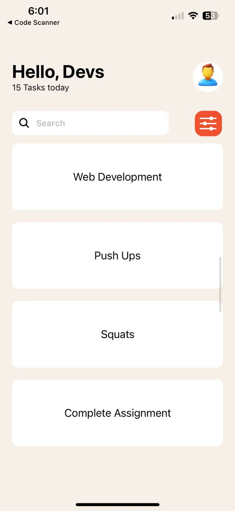

# Student ID: 11024275

## Text

**Usage:** 
The `Text` component is used to display text in your React Native app. It supports nesting, styling, and touch handling.

## ScrollView

**Usage:**
The `ScrollView` component is used to create a scrollable container. It can contain multiple components and views, allowing users to scroll vertically or horizontally through the content.

## TextInput

**Usage:**
The `TextInput` component is used to capture user input. It can be configured for different types of input such as text, numbers, passwords, etc.

## Stylesheet

**Usage:**
The `StyleSheet` is used to create style objects in React Native. It helps in defining styles for components in a structured and optimized way.

## Button

**Usage:**
The `Button` component is used to render a button that users can press to trigger actions or navigate within the app.

## FlatList

**Usage:**
The `FlatList` component is used to render a list of items efficiently. It only renders the items that are currently visible on the screen, which improves performance for large lists.

## Screenshots of The App

